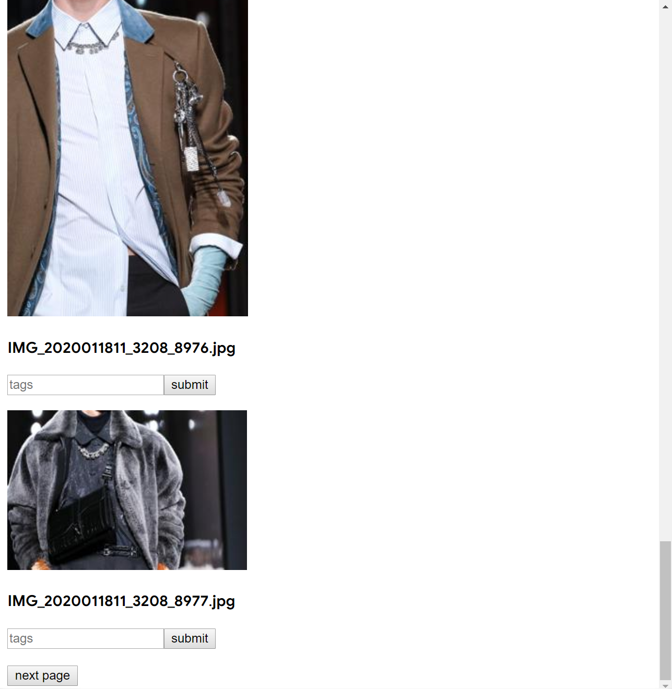

# 本地图片管理服务器

## 简介

### intro

一个简单的基于python-flask ,sqlite3,和react-js 的服务器图片管理展示

a simple web server base on python-flask ,sqlit3 and react-js.

## 设想

后端由flask处理路由，提供静态资源，访问本地图片资源。

由pillow压缩图片。

sqlit3 处理压缩后的图片路径与缩略图路径，并依靠3f关系型数据建立联系表，提供文件查询与标签管理。

前端由访问react-js进行开发，获取页面数据后，访问静态的缩略图（暂不考虑flask动态建立url访问原图），并更新页面信息，提交请求，查看原图或标签增减

前端美化，正在考虑antd，结果文件过大考虑放弃

## 进度

目前：

flask端，基本路由，压缩，展示标签

react端，基本数据的传输，资源的申请，标签的更改与提交

之后：

完善前后端逻辑，删改冗余，封装抽离关键组件

前端美化

